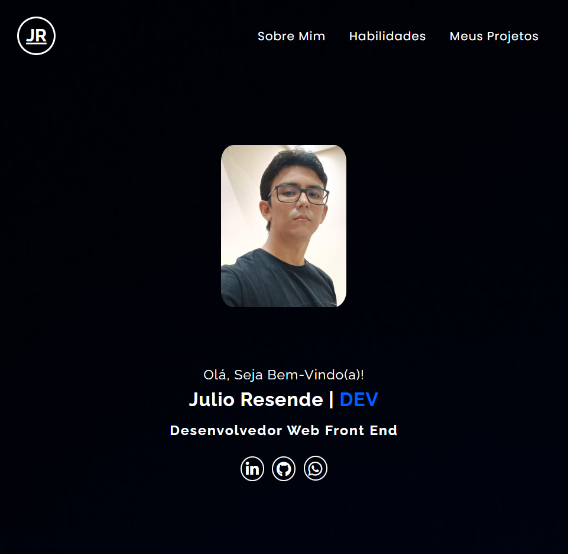

# Portfolio

## Sumário

- [Visão geral](#visão-geral)
  - [O Desafio](#o-desafio)
  - [Screenshot](#screenshot)
- [Links](#links)
- [Meu processo](#meu-processo)
  - [Tecnologias](#tecnologias-usadas)
  - [O que eu aprendi](#o-que-aprendi)
  - [Dificuldades](#dificuldades)
- [Contato](#contato)

## Visão Geral

### O Desafio

Os usuários devem ser capazes de:

- Interagir com o layout ideal para o aplicativo, dependendo do tamanho da tela do dispositivo;
- Interagir com os estados de foco para todos os elementos interativos na página;
- Conseguir acessar os links das redes sociais tão quanto os projetos.

### Screenshot

## Links

- Repositório: 
- Deploy: 

## Meu Processo

### Tecnologias usadas:

- HTML5 Semantico
- Mobile-first
- CSS3 responsivo
- Flexbox
- Grid

### O que aprendi?

- Pude consolidar ainda mais meus conhecimentos em HTML semântico, o poder das grouping tags de facilitarem a estruturação do projeto, links posicionados de forma semântica;  
- Também o CSS responsivo com Media Queries para gerar uma melhor experiência para o usuário, independendo do dispositivo. Flexbox, elementos posicionados de forma rápida e prática. Modelo de Caixas. Tipografia. Variaveis. Displays ;  
- Grid acabou facilitando posicionar determinados elementos de uma vez só e de forma responsiva.

### Dificuldades

De início, tive dificuldade com  Grid, por não ter o costume de utilizar muito esta técnica. Foi aplicada na sessão dos meus projetos.

## Contato

- Github - [julioresende77](https://github.com/julioresende77)
- Frontend Mentor - [@julioresende77](https://www.frontendmentor.io/profile/julioresende77)
- Linkedin - [@resendedev](https://www.linkedin.com/in/resendedev/)

